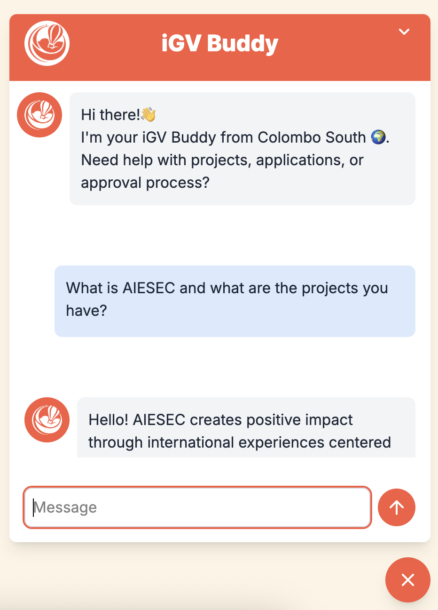

# iGV Buddy Chatbot 🤖

An intelligent chatbot application designed to assist with AIESEC Global Volunteer (iGV) programs in Sri Lanka. Built with React and powered by AI, this chatbot serves as a digital assistant for prospective volunteers, providing instant support for applications, project information, and cultural guidance.

## 🌟 Features

- **Interactive Chat Interface**: Clean, modern chat UI with smooth animations
- **AI-Powered Responses**: Intelligent responses using Google's Gemini API
- **Comprehensive Knowledge Base**: Detailed information about AIESEC in Colombo South and Sri Lanka
- **Real-time Messaging**: Instant responses with typing indicators
- **Responsive Design**: Works seamlessly on desktop and mobile devices
- **Floating Chat Button**: Unobtrusive chat widget that can be toggled on/off
- **Auto-scroll**: Messages automatically scroll to show the latest conversation
- **Error Handling**: Graceful error handling with user-friendly messages

## 🚀 Getting Started

### Prerequisites

- Node.js (v14 or higher)
- npm or yarn package manager
- Google Gemini API key

### Installation

1. **Clone the repository**
   ```bash
   git clone https://github.com/Mindi-R/Chatbot-for-iGV.git
   cd Chatbot-for-iGV
   ```

2. **Install dependencies**
   ```bash
   npm install
   ```

3. **Set up environment variables**
   Create a `.env` file in the root directory and add your API configuration:
   ```env
   VITE_API_URL=your_gemini_api_endpoint_here
   ```

4. **Start the development server**
   ```bash
   npm run dev
   ```

5. **Open your browser**
   Navigate to `http://localhost:5173` to view the application

## 🛠️ Built With

- **React 19.0.0** - Frontend framework
- **Vite** - Build tool and development server
- **Tailwind CSS** - Utility-first CSS framework
- **Google Gemini API** - AI-powered conversational responses
- **Material Symbols** - Icon library

## 📱 Screenshots

### Chat Interface

*The main chat interface showing the iGV Buddy assistant*

### Friendy Intercations

*Responsive and friendly*

## 📁 Project Structure

```
Chatbot-for-iGV/
├── public/
│   └── vite.svg
├── src/
│   ├── assets/
│   │   ├── GV LOGO COLOR.png
│   │   ├── GV LOGO WHITE.png
│   │   └── react.svg
│   ├── components/
│   │   ├── ChatForm.jsx
│   │   └── ChatMessage.jsx
│   ├── App.jsx
│   ├── App.css
│   ├── index.css
│   ├── main.jsx
│   └── iGVinfo.js
├── eslint.config.js
├── index.html
├── package.json
├── README.md
└── vite.config.js
```

## 🎯 How It Works

1. **User Interaction**: Users click the floating chat button to open the chatbot
2. **Message Processing**: User messages are processed and sent to the AI API
3. **AI Response**: The system generates contextual responses based on the knowledge base
4. **Real-time Display**: Messages appear instantly with smooth animations
5. **Continuous Conversation**: Chat history is maintained throughout the session

## 🤝 What the Bot Can Help With

- Application process for Global Volunteer programs
- Project information and requirements
- Approval process guidance
- Pre-departure preparation
- Cultural insights about Sri Lanka
- Transportation and accommodation details
- Visa application support
- Safety and emergency information
- Packing recommendations
- Currency and budgeting advice

## 🔧 Configuration

### Environment Variables

| Variable | Description | Required |
|----------|-------------|----------|
| `VITE_API_URL` | Google Gemini API endpoint | Yes |


## 📝 Available Scripts

- `npm run dev` - Start development server
- `npm run build` - Build for production
- `npm run lint` - Run ESLint for code quality
- `npm run preview` - Preview production build


### Building for Production

```bash
npm run build
```

The built files will be in the `dist/` directory, ready for deployment to any static hosting service.

## 🙏 Acknowledgments

- AIESEC in Colombo South for project requirements and content
- Google Gemini API for AI capabilities
- React and Vite communities for excellent documentation
- Tailwind CSS for the utility-first approach

---

Made with ❤️ for the AIESEC Global Volunteer community
## 🚀 New Feature Demo

This is a demonstration of how to add new features and create pull requests.

- Feature branches should be created from `main`
- Pull requests should target `master`
- After merging to `master`, sync back to `main`

### Example workflow:
```bash
git checkout main
git checkout -b feature/my-new-feature
# Make changes
git add .
git commit -m "Add my new feature"
git push origin feature/my-new-feature
# Create PR: feature/my-new-feature -> master
```
